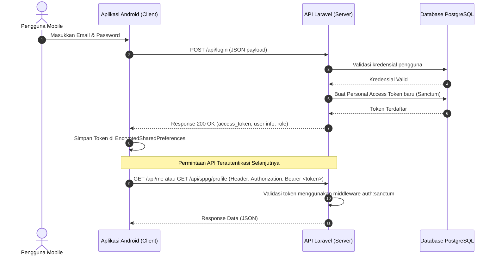
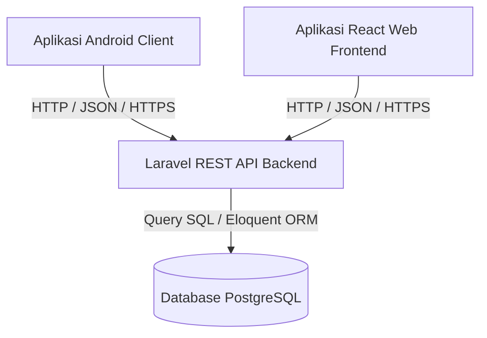

# Rencana Integrasi Sistem (PLAN_INTEGRATION.md)

Dokumen ini menjelaskan rencana teknis untuk mengintegrasikan **Aplikasi Android HaloMBG-mobile** dengan **Web Backend HaloMBG (Laravel + PostgreSQL)** yang berada di repositori `praktikum-rpl-a-02`.

---

## 1. Mekanisme Autentikasi (Authentication Flow)

Autentikasi antara aplikasi Android dan server Laravel menggunakan **Laravel Sanctum** berbasis token API (Bearer Token). 

### A. Alur Kerja Autentikasi (Auth Flowchart)



### B. Penyimpanan Token yang Aman pada Klien (Client-Side Storage)
Untuk mencegah kebocoran token di perangkat Android, token disimpan menggunakan [EncryptedSharedPreferences](file:///c:/Users/ACER/OneDrive/Dokumen/HaloMBG-mobile/app/src/main/java/com/halombg/mobile/data/AuthRepository.kt) yang menggunakan enkripsi tingkat perangkat keras (AES-256):
*   **File Penyimpanan**: `secure_auth_prefs`
*   **Kelas Pengelola**: [AuthRepository](file:///c:/Users/ACER/OneDrive/Dokumen/HaloMBG-mobile/app/src/main/java/com/halombg/mobile/data/AuthRepository.kt)
*   **Metode Penyimpanan**:
    ```kotlin
    fun saveToken(token: String) {
        sharedPreferences.edit().putString("auth_token", token).apply()
    }
    ```

### C. Pengiriman Token Otomatis dengan OkHttp Interceptor
Setiap kali aplikasi Android melakukan pemanggilan API, token harus disisipkan secara dinamis ke dalam Header HTTP. Hal ini dikelola secara otomatis menggunakan interceptor pada [NetworkModule.kt](file:///c:/Users/ACER/OneDrive/Dokumen/HaloMBG-mobile/app/src/main/java/com/halombg/mobile/data/api/NetworkModule.kt):
```kotlin
val authInterceptor = Interceptor { chain ->
    val requestBuilder = chain.request().newBuilder()
    authRepository.getToken()?.let { token ->
        requestBuilder.addHeader("Authorization", "Bearer $token")
    }
    chain.proceed(requestBuilder.build())
}
```

### D. Alur Logout
1.  Klien Android memanggil endpoint `POST /api/logout`.
2.  Backend Laravel akan menghapus token saat ini dari tabel `personal_access_tokens` di database.
3.  Klien Android memanggil `authRepository.clearAll()` untuk menghapus token dan data sesi dari penyimpanan lokal perangkat.

---

## 2. Arsitektur Database Gabungan (Unified Database Architecture)

Aplikasi Android **tidak terhubung langsung** ke database PostgreSQL demi alasan keamanan (SQL injection, kebocoran kredensial DB, dll.). 

Android dan React Web Frontend berinteraksi dengan database yang sama (gabungan) melalui **REST API Unified** yang disediakan oleh Laravel. Konsep ini disebut **Single Source of Truth (SSOT)**.

### A. Diagram Integrasi Database



### B. Sinkronisasi Data & Kolaborasi Fitur

Karena database-nya terintegrasi (gabungan), aksi yang dilakukan di aplikasi mobile akan langsung tersinkronisasi dan berdampak pada aplikasi web, begitu pula sebaliknya:

1.  **Status Distribusi Makanan (Dapur SPPG & Sekolah)**:
    *   **Mobile (Aksi SPPG)**: Operator SPPG mengantar makanan ke sekolah dan mengubah status distribusi menjadi `sudah_diantar` serta mengunggah bukti foto melalui aplikasi Android.
    *   **Database**: Laravel memperbarui tabel `distribution_statuses` dan menyimpan teks Base64 foto.
    *   **Web (Dampak Publik/Admin)**: Grafik dan tabel status pengiriman di Web React langsung terupdate secara real-time saat publik atau admin melihat dashboard.

2.  **Ulasan Siswa & Tindak Lanjut SPPG**:
    *   **Mobile (Aksi Siswa)**: Siswa mengisi formulir ulasan harian, mengambil foto makanan yang kurang layak (misal: "basi"), dan mengirim ulasan lewat Android.
    *   **Database**: Laravel menyimpan ulasan ke tabel `reviews`. Jika terdapat kata kunci kritis (seperti *basi*, *bau*), Laravel menandai `is_critical = true` dan membuat baris di tabel `critical_review_followups`.
    *   **Notifikasi & Web**: Backend Laravel mengirim notifikasi WhatsApp ke pengelola SPPG. Di Dashboard Web SPPG, notifikasi ulasan kritis langsung muncul agar pengelola dapat memberikan tanggapan/catatan tindak lanjut (`handling_note`).

### C. Penanganan Format Media Foto
Database PostgreSQL menyimpan kolom `photo` pada tabel `reviews` dan `distribution_statuses` menggunakan tipe data `text` (untuk menyimpan string Base64 yang panjang). 
*   **Android** mengubah gambar kamera menjadi string Base64 dengan format Data URI:
    `data:image/jpeg;base64,/9j/4AAQSkZJRg...`
*   **Laravel** menerima string ini apa adanya dan menyimpannya ke database.
*   **React Web** memuat string Base64 ini langsung ke tag `` untuk menampilkannya ke admin/pengguna web.
*   Ini meminimalkan kompleksitas manajemen file penyimpanan statis (seperti Amazon S3 atau local storage disk) pada server lokal.

---

## 3. Rencana Aksi Sinkronisasi Kode API

Untuk memastikan koneksi autentikasi dan sinkronisasi database berjalan sempurna, langkah-langkah berikut harus diterapkan pada kode Android:

| No | Target File | Perubahan yang Diperlukan |
|---|---|---|
| 1 | [NetworkModule.kt](file:///c:/Users/ACER/OneDrive/Dokumen/HaloMBG-mobile/app/src/main/java/com/halombg/mobile/data/api/NetworkModule.kt) | Ubah `BASE_URL` ke `http://10.0.2.2/api/` (untuk Emulator) atau IP lokal komputer Anda (untuk HP fisik). |
| 2 | [network_security_config.xml](file:///c:/Users/ACER/OneDrive/Dokumen/HaloMBG-mobile/app/src/main/res/xml/network_security_config.xml) | Tambahkan `<domain-config>` untuk memperbolehkan Cleartext Traffic (HTTP) bagi IP lokal (`10.0.2.2`, `localhost`). |
| 3 | [ApiService.kt](file:///c:/Users/ACER/OneDrive/Dokumen/HaloMBG-mobile/app/src/main/java/com/halombg/mobile/data/api/ApiService.kt) | 1. Tambahkan `@SerializedName("access_token")` pada properti token di model `LoginResponse`. <br>2. Ubah endpoint `@GET("user")` menjadi `@GET("me")`. <br>3. Ubah rute tindak lanjut ulasan kritis menjadi `@PUT("sppg/followups/{id}")` dengan request model `FollowUpRequest` menggunakan properti `followup_status` (bukan `status`). |
