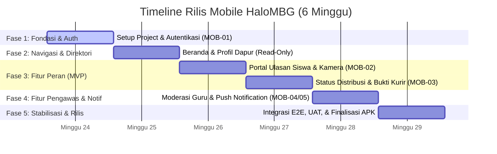

# Timeline Pengembangan (Development) - HaloMBG Mobile App

Berikut adalah rencana timeline pengembangan 6 minggu untuk HaloMBG versi mobile (Android). Rencana ini disusun secara bertahap (incremental) mulai dari persiapan awal, pengembangan fitur inti (MVP), fitur pelengkap (notifikasi), hingga diakhiri dengan fase integrasi, pengujian, dan rilis final.

---

## Ikhtisar Garis Waktu (Gantt Chart)

---

## Rincian Rencana Kerja Mingguan

### Minggu 1 — Inisialisasi Project, Setup MVVM, & Autentikasi (MOB-01)
Fokus minggu pertama adalah membangun kerangka dasar arsitektur aplikasi (MVVM), setup dependensi pihak ketiga, serta modul autentikasi terenkripsi.

*   **Aktivitas Utama:**
    *   **Project Setup:** Inisialisasi project Android Studio dengan Gradle Kotlin DSL, Jetpack Compose, dan Material 3.
    *   **Theme & Styling:** Implementasi token warna sesuai dengan panduan desain HaloMBG (Emerald/Slate - dominan Hijau Mint `#2E7D32` dan background abu-abu bersih `#F8F7F5`).
    *   **Network & DI Setup:** Setup Retrofit2, OkHttpClient dengan `AuthInterceptor` untuk menyisipkan Bearer token secara global, dan setup dependency injection (misal: Hilt/Koin).
    *   **Penyimpanan Sesi:** Implementasi `EncryptedSharedPreferences` untuk menyimpan token autentikasi (Laravel Sanctum Bearer Token) secara aman di penyimpanan lokal.
    *   **UI Login & ViewModel:** Form login dengan validasi surel/sandi, integrasi API login, penanganan status loading/error, dan tombol simulasi multi-role (offline mode).
    *   **Auto-Login:** Memeriksa ketersediaan token saat aplikasi pertama kali dibuka agar pengguna langsung masuk jika sesi masih aktif.
*   **Kriteria Selesai (Definition of Done):** Pengguna dapat login secara online/offline, token tersimpan dengan aman di penyimpanan lokal terenkripsi, dan fitur auto-login berfungsi dengan baik.

---

### Minggu 2 — Landing Page (Beranda), Navigasi Utama, & Direktori Profil Dapur
Fokus minggu kedua adalah membangun alur navigasi utama antar-layar dan menyediakan direktori profil dapur yang bersifat read-only untuk publik/seluruh peran.

*   **Aktivitas Utama:**
    *   **Landing Page (Beranda) UI:** Implementasi tampilan beranda publik dengan visual statistik (misal: jumlah porsi hari ini, jumlah dapur aktif) dan search bar untuk mencari sekolah.
    *   **Navigasi Global:** Setup Compose Navigation dengan bottom navigation bar atau home icon agar semua peran dapat dengan mudah kembali ke halaman beranda.
    *   **Fitur Pencarian:** Implementasi pencarian sekolah tujuan untuk melihat status penanggung jawab dapur SPPG yang melayani.
    *   **Direktori Profil Dapur:** Halaman dialog / bottom sheet pilihan dapur yang menampilkan profil lengkap dapur SPPG secara read-only (alamat, kapasitas porsi, penanggung jawab, kontak WhatsApp/Telepon, deskripsi) untuk semua jenis user (guest maupun logged-in).
*   **Kriteria Selesai (Definition of Done):** Struktur navigasi utama selesai dibentuk, pencarian sekolah berfungsi, dan profil dapur SPPG dapat diakses secara read-only dari beranda.

---

### Minggu 3 — Portal Ulasan Siswa & Integrasi Kamera Native (MOB-02)
Fokus minggu ketiga adalah implementasi antarmuka khusus siswa untuk mengisi ulasan makanan harian secara native dengan integrasi kamera.

*   **Aktivitas Utama:**
    *   **Dashboard Siswa:** Layar khusus siswa yang menampilkan nama sekolah, menu makan hari ini, dan riwayat ulasan yang pernah dikirim.
    *   **Pengecekan Hubungan Dapur:** Integrasi API `/api/siswa/sppg-info` untuk memvalidasi apakah sekolah siswa sudah dilayani dapur SPPG.
    *   **Form Input Ulasan:** Validasi input teks ulasan (minimal 10 karakter) dan penanganan rating bintang.
    *   **Integrasi Kamera Native:** Membuka kamera menggunakan `ActivityResultContracts.TakePicture()` untuk menjamin kompatibilitas perangkat tanpa overhead setup CameraX yang rumit.
    *   **Pemrosesan Gambar:** Konversi foto hasil tangkapan kamera menjadi representasi Base64 string / Multipart payload untuk dikirim ke API `/api/siswa/reviews`.
*   **Kriteria Selesai (Definition of Done):** Siswa dapat menulis ulasan, mengambil foto makanan secara native, melihat pratinjau foto sebelum dikirim, dan mengirimkannya ke server.

---

### Minggu 4 — Status Distribusi & Bukti Pengiriman Kurir SPPG (MOB-03)
Fokus minggu keempat adalah menyediakan modul pengiriman khusus bagi kurir/SPPG untuk memantau jadwal antar dan memperbarui bukti serah terima secara real-time.

*   **Aktivitas Utama:**
    *   **Layar Jadwal Distribusi:** Menampilkan daftar sekolah tujuan pengantaran hari ini berdasarkan data dari API `/api/sppg/distribution?date=yyyy-MM-dd`.
    *   **Badge Status Pengiriman:** Pembuatan badge visual dengan warna modern (Merah: `batal`/`belum_diantar`, Kuning: `siap_diantar`, Hijau: `sudah_diantar`).
    *   **Layar Konfirmasi Pengiriman:** BottomSheet / Dialog ketika item sekolah diklik, yang berisi dropdown status baru dan tombol untuk mengambil foto bukti pengiriman.
    *   **Kamera Bukti Delivery:** Integrasi kamera untuk mengambil foto bukti serah terima (foto makanan di sekolah/penerima) dan mencatat timestamp pengiriman secara otomatis.
    *   **API Update:** Integrasi endpoint `PUT /api/sppg/distribution/{id}` untuk mengirim pembaruan status dan foto bukti.
*   **Kriteria Selesai (Definition of Done):** Kurir dapat melihat daftar antrean pengantaran sekolah hari ini, mengubah status distribusi, dan melampirkan bukti foto pengiriman.

---

### Minggu 5 — Moderasi Guru (MOB-04) & Notifikasi Real-Time (MOB-05)
Fokus minggu kelima adalah memperluas fitur pemantauan untuk Guru dan mengintegrasikan sistem push notification menggunakan Firebase Cloud Messaging (FCM).

*   **Aktivitas Utama:**
    *   **Dashboard Guru:** Umpan (feed) khusus untuk menampilkan daftar ulasan makanan dari siswa di sekolah bersangkutan (`/api/guru/reviews`).
    *   **Flagging Ulasan:** Tombol aksi cepat untuk menandai/melaporkan (*flagging*) ulasan siswa yang dinilai tidak pantas/mengandung kata kasar.
    *   **Integrasi Firebase Cloud Messaging (FCM):** Setup FCM SDK di project Android dan penanganan notifikasi background/foreground.
    *   **Push Notification Guru:** Mengirim notifikasi push ke perangkat guru ketika ada ulasan baru masuk dari siswa di sekolahnya.
    *   **Push Notification SPPG (Kritis):** Deteksi otomatis kata kunci kritis (seperti: basi, bau, busuk, kotor) pada ulasan siswa untuk dikirim sebagai notifikasi darurat ke pengelola SPPG.
    *   **Tindak Lanjut SPPG:** Panel bagi SPPG untuk menanggapi ulasan kritis dengan mengubah status penanganan (`belum_diproses`, `dalam_proses`, `selesai`).
*   **Kriteria Selesai (Definition of Done):** Guru dapat memantau ulasan siswa dan memberikan flag, sistem push notification FCM berjalan lancar baik saat aplikasi aktif maupun di latar belakang.

---

### Minggu 6 — Integrasi Akhir, Testing (UAT), & Finalisasi Rilis
Fokus minggu keenam adalah pengujian menyeluruh, optimalisasi performa, pembersihan bug (*bug fixing*), dan pengemasan aplikasi ke bentuk siap rilis.

*   **Aktivitas Utama:**
    *   **End-to-End (E2E) Integration Testing:** Pengujian alur data lengkap (misal: Kurir update status -> Beranda publik terupdate -> Siswa kirim ulasan -> Guru terima notif & ulasan tampil di feed -> SPPG terima notif jika ulasan kritis).
    *   **Usability Testing (UAT):** Pengujian aplikasi oleh perwakilan pengguna (Siswa, Guru, Kurir SPPG) untuk memastikan antarmuka mudah dipahami dan alur kerja logis.
    *   **Security & Network Audit:** Memeriksa siklus kedaluwarsa token di `EncryptedSharedPreferences` dan memastikan komunikasi data API sepenuhnya menggunakan enkripsi HTTPS.
    *   **Performance Optimization:** Memperbaiki potensi kebocoran memori (*memory leak*), mengompresi aset gambar, dan mengaktifkan Proguard/R8 untuk proteksi kode serta pengecilan ukuran APK.
    *   **Build Final:** Mengemas aplikasi ke dalam format signed release build Android App Bundle (`.aab`) atau Android Package (`.apk`) untuk siap didistribusikan.
    *   **Dokumentasi Pengguna:** Penyusunan panduan singkat (*user manual*) penggunaan aplikasi mobile untuk tiap peran.
*   **Kriteria Selesai (Definition of Done):** Aplikasi mobile HaloMBG bebas dari bug kritis, performa stabil pada berbagai versi Android, dan file APK/AAB rilis telah siap didistribusikan ke pengguna.
